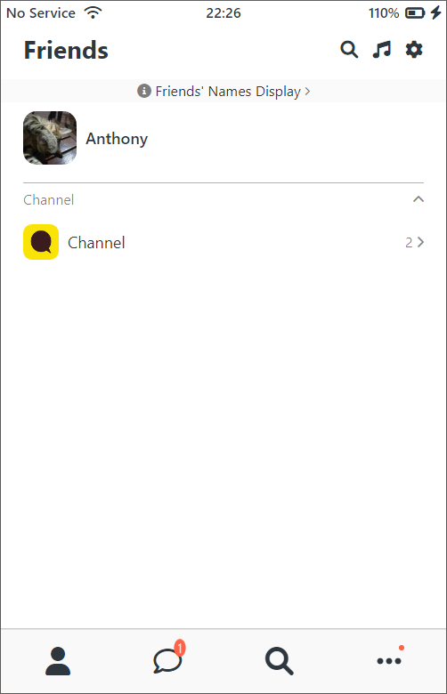
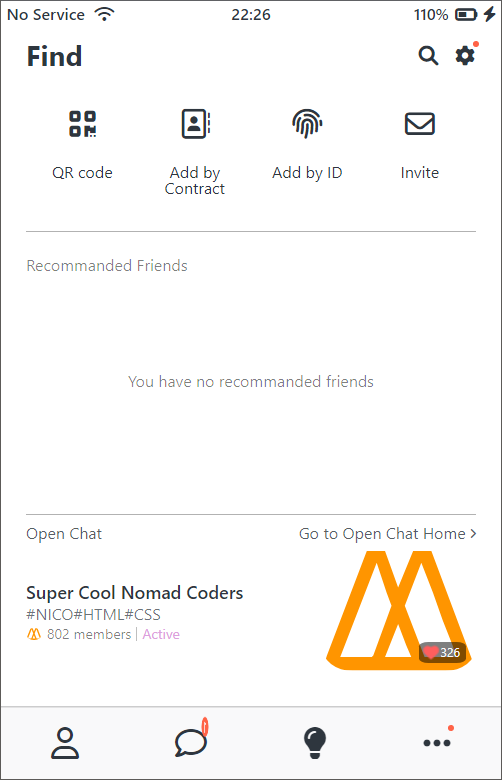
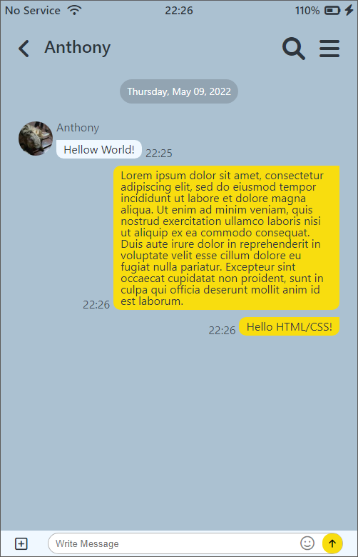

# 2022 Kakao Clone

<a href="https://my-roki.github.io/kakao_clone/" target="_blank">github.io page</a>

### What I Learned.

- [x] IDs & Classes
- [x] HTML Tags
- [x] Semantic & non-semantic tags
- [x] Box Model
- [x] Inline, Block, inline-block
- [x] CSS Position
- [x] Flexbox
- [x] Selectors
- [x] Pseudo Selectors
- [x] Transitions
- [x] Animations
- [x] Media Queries

### What I Updated.

Copyright

<a href="https://nomadcoders.co/kokoa-clone" target="_blank">
NomadCoder - 코코아톡 클론 코딩
</a>
